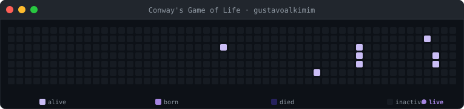

<div align="center">


<a href="https://git.io/typing-svg">
  
</a>

<br/>

[](https://www.linkedin.com/in/gustavo-alkimim-73091b24a/)
[](https://github.com/gustavoalkimim)
[](https://github.com/gustavoalkimim?tab=followers)

</div>

<br/>

## 👨‍💻 About Me

```yaml
student:
  name: "Gustavo Alkimim"
  course: "Computer Science"
  focus: ["C", "C++", "Software Engineering", "Problem Solving"]
  currently_learning: ["Data Structures & Algorithms", "Artificial Intelligence", "OOP"]
  motto: "Turning curiosity into code, one project at a time."
```

- 🎓 Computer Science student, passionate about building things from the ground up.
- 🔭 Currently sharpening my fundamentals in **C / C++**, low-level programming, and clean software design.
- 🌱 Actively studying **Data Structures & Algorithms**, **AI**, and **Software Engineering** practices.
- 🤝 Open to academic collaborations, study groups, and small open-source contributions.
- 🤖 This profile is intentionally automated — the stats, activity, and simulation below update themselves via scheduled GitHub Actions.

<br/>

## 🛠️ Tech Stack

**Languages**
<br/>


**Tools, Build & DevOps**
<br/>


**Graphics, UI & Game Dev**
<br/>


**Design & Data**
<br/>


<br/>

## 📊 GitHub Analytics

> Generated daily via GitHub Actions ([lowlighter/metrics](https://github.com/lowlighter/metrics)).

<div align="center">


</div>

<br/>

## 🤖 Live Activity
> Auto-updated every 6 hours via GitHub Actions.

<!--START_SECTION:activity-->
1. ⬆️ Pushed 1 commit to [gustavoalkimim/Prova_de_DIW](https://github.com/gustavoalkimim/Prova_de_DIW) · 22/09
2. 🌿 Created branch `main` in [gustavoalkimim/Prova_de_DIW](https://github.com/gustavoalkimim/Prova_de_DIW) · 22/09
3. 🌿 Created branch `master` in [gustavoalkimim/secureloginpuc](https://github.com/gustavoalkimim/secureloginpuc) · 10/09
4. ⬆️ Pushed 1 commit to [gustavoalkimim/petvet](https://github.com/gustavoalkimim/petvet) · 10/09
5. 🌿 Created branch `master` in [gustavoalkimim/petvet](https://github.com/gustavoalkimim/petvet) · 10/09
<!--END_SECTION:activity-->

<br/>

## 🧬 Conway's Game of Life
> Seeded from my real contribution history · regenerated every Monday via GitHub Actions.

<div align="center">

</div>

<br/>

## 🚀 Projetos Principais

- **[PetVet](https://github.com/gustavoalkimim/petvet)** — MVP de uma startup B2B2C (clínica veterinária → tutor de pet). Backend Java/Spring Boot com JWT e camada de segurança, frontend React + TypeScript. Projeto real, ainda incompleto, com bugs conhecidos documentados no próprio README.
- **[SecureLoginPUC](https://github.com/gustavoalkimim/secureloginpuc)** — Autenticação com Spring Security (login, BCrypt, controle de papel admin/usuário). Cadastro e recuperação de senha ainda são apenas interface, sem persistência.
- **[Fisiogrip](https://github.com/Mavilaa/Fisiogrip)** — Projeto em equipe (colaborador): carteirinha digital de acompanhamento de fisioterapia, feito em MIT App Inventor.
- **[Soc Ops](https://github.com/gustavoalkimim/socops-microsoft-workshop)** — Bingo social para dinâmicas de equipe, feito em workshop da Microsoft com GitHub Copilot em fluxo multi-agente.

<br/>

## 🌱 Currently Learning

| Topic | Status |
|---|---|
| Data Structures & Algorithms | 🟣 In progress |
| Artificial Intelligence | 🟣 In progress |
| Software Engineering | 🟣 In progress |
| Object-Oriented Programming | 🟣 In progress |

<br/>

## 📫 Connect

<div align="center">

[](https://www.linkedin.com/in/gustavo-alkimim-73091b24a/)
[](https://github.com/gustavoalkimim)

</div>

<div align="center">

*"Turning curiosity into code, one project at a time."* 🚀


</div>
